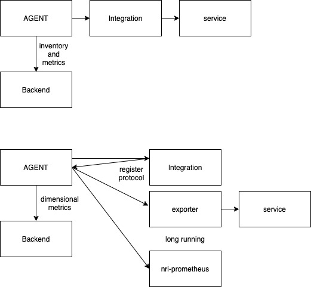

[](https://opensource.newrelic.com/oss-category/#community-project)

# newrelic-integration-e2e-action

End to end testing action for New Relic integrations to ensure that:

- The integrations are correctly executed by the agent.
- The service metrics and entities are correctly sent to NROne.

New Relic has two kinds of integrations:
- Custom made integrations (e2e testing still not supported)
- Integrations based on prometheus exporters



## Steps executed by the e2e action

- It reads the e2e test descriptor file/s that must be passed as an argument to the action.
- For each scenario present in the descriptor:  
    - It installs the infrastructure agent & the required packages.
    - It launches services dependencies (e.g. a docker-compose ) if specified in the before step.
    - It verifies that the required services are up & running
    - It creates a config file with the details in the descriptor. 
    - Adds a custom-attribute to the config:
        - Composed by the current commit sha + a new 10 alphanumeric-random digit on each scenario.
        - The tests will look for this label to fetch the metrics and the entities from the New Relic backend.
    - The runner executes the tests one by one, checking that metrics &/or entities are being created correctly. 
    - If the test fails, it's retried after the `retry_seconds` (default 30s) and up to the `retry_attempts` (default 10) defined for the action. 
    - It stops & removes the services if specified in the after step.
    - If `verbose` is true it logs the agent logs with other debug information.
- The action is completed.

## Usage

Example usage:
```yaml
name: e2e
on:
  push:
    branches: ["powerdns_e2e"]
  workflow_dispatch:
    branches: ["powerdns_e2e"]
jobs:
  powerdns-e2e:
    name: E2E tests for PowerDNS
    runs-on: ubuntu-latest
    steps:
      - name: checkout-repository
        uses: actions/checkout@v2
      - name: Setup go
        uses: actions/setup-go@v1
        with:
          go-version: 1.17
      - name: build-powerdns
        run: make build-powerdns
      - name: e2e-test
        uses: newrelic/newrelic-integration-e2e-action@v1
        with:
          spec_path: exporters/powerdns/e2e/e2e_spec.yml
          account_id: ${{ secrets.ACCOUNT_ID }}
          api_key: ${{ secrets.API_KEY }}
          license_key: ${{ secrets.LICENSE_KEY }}
          agent_dir: exporters/powerdns/e2e/agent_dir
          retry_seconds: 30
          retry_attempts: 10
          verbose: false
```

The required fields are:
- `spec_path` to define the e2e.
- `account_id` required by the NR Api.
- `api_key` required by the NR Api.
- `license_key` required by the agent.

Optional parameters:
- `agent_dir` path for a custom agent_dir for the specific e2e with a docker-compose and Dockerfile in it. By default, the one in this action will be used.
- `retry_seconds` it's the number of seconds to wait after retrying a test. default: 30.
- `retry_attempts` it's the number of attempts a failed test can be retried. default: 10.
- `verbose` if set to to true the agent logs and other useful debug logs will be printed. default: false.

## Spec file for the e2e 

The paths of the binaries in this file are relative to its parent folder.

The spec file for the e2e needs to be a yaml file with the following structure:

`decription` : Description for the e2e test. 

`agent` `: Extra environment variables and/or integrations required for the e2e.
- `integrations` : Additional integrations needed for the e2e.
- `env_vars` : Additional EnvVars for the agent execution.

`scenarios`: Array of scenarios, each one is an independent run for the e2e.
- `decription` : Description of the scenario.
- `before` : Array of shell commands that will be executed by the e2e runner before the next steps of the scenario. (Here is where the docker-compose commands need to be put to setup the environment)
- `after` : Array of shell commands that will be executed by the e2e runner as the last step of the scenario.
- `integrations` : Array with the integrations running in this scenario.
  - `name` : Name of the integration under test.
  - `binary_path` : Relative path to the integration binary.
  - `exporter_binary_path` : Relative path to the prometheus exporter if it's needed (Prometheus based integrations)
  - `config` : The config values for this NR integration that will be red by the agent to execute the integration.
- `tests` : The 3 kinds of tests that will be done to the New relic api to check for metrics/entities in NROne:
  - `nrqls` : Array of queries that will be executed independently and will fail if returned value is nil. 
  - `metrics` : Array of metrics to chek existing in NROne
    - `source` : Relative path to the integration spec file (It defines the entities and metrics) that will be parsed to match the metrics got from NROne.
    - `except_entities` : Array of entities whose metrics will be skipped.
    - `except_metrics` : Array of metrics to skip.
  - `entities` : Array of entities to chek existing in NROne.
    - `type` : Type of the entity to look for in NROne
    - `data_type` : Name of the table to check for the entity in NROne (If V4 integration, will always be Metric)
    - `metric_name` : Name of the known metric that should be having the entity dimension in NROne.

Example:
```yaml
description: |
  End-to-end tests for PowerDNS integration

agent:
  integrations:
    nri-prometheus:  bin/nri-prometheus # nri-prometheus is added with the agent by default, but we added here as an example
  env_vars:
    NRJMX_VERSION: "1.5.3"

scenarios:
  - description: |
      This scenario will verify that metrics froms PDNS authoritative
      are correcly collected.
    before:
      - docker-compose -f "deps/docker-compose.yml" up -d
    after:
      - docker-compose -f "deps/docker-compose.yml" down -d
    integrations:
      - name: nri-powerdns
        binary_path: bin/nri-powerdns
        exporter_binary_path: bin/nri-powerdns-exporter
        config:
          powerdns_url: http://localhost:8081/api/v1/
          exporter_port: 9121
          api_key: authoritative-secret
    tests:
      nrqls:
        - query: "SELECT average(powerdns_authoritative_queries_total) FROM Metric"
      entities:
        - type: "POWERDNS_AUTHORITATIVE"
          data_type: "Metric"
          metric_name: "powerdns_authoritative_up"
        - type: "POWERDNS_RECURSOR"
          data_type: "Metric"
          metric_name: "powerdns_recursor_up"
      metrics:
        - source: "powerdns.yml"
          except_entities:
            - POWERDNS_AUTHORITATIVE
          except_metrics:
            - powerdns_authoritative_answers_bytes_total
            - powerdns_recursor_cache_lookups_total
          # additionals: ""
```

## Types of test
All the queries done to NROne are done with an extra WHERE condition that is `WHERE testKey = 'COMMMITSHA + 10 Digit alphanumeric'` a custom attribute added to the agent. This attribute is decorated in all the emitted metrics. 

In this way we ensure that every returned metric/entity is really the emitted by the current e2e scenario.

Example:
`SELECT * from Metric where metricName = 'powerdns_authoritative_up' where testKey = '35e32b6a00dec02ae7d7c45c6b7106779a124685sneniedzku' limit 1`
### Entities
This test is to ensure that the list of entites specified on the array have been created in NRone.
### Metrics
This test is to check if the metrics specified in the spec file added to the pipeline's e2e source attribute are present on NROne. The current approach is to copy this spec file in the e2e path.

Example of metrics spec file:
```yaml
specVersion: "2"
owningTeam: integrations
integrationName: powerdns
humanReadableIntegrationName: PowerDNS
entities:
  - entityType: POWERDNS_AUTHORITATIVE
    metrics:
      - name: powerdns_authoritative_deferred_cache_actions
        type: count
        defaultResolution: 15
        unit: count
        dimensions:
          - name: type
            type: string
  - entityType: POWERDNS_Recursive
    metrics:
      - name: powerdns_recursive_deferred_cache_actions
        type: count
        defaultResolution: 15
        unit: count
        dimensions:
          - name: type
            type: string
```

This file will be parsed, getting each entity type and the metric names associated. The e2e will do a query to NROne to get all metrics with the testkey of the scenario and will fail if one is not found. 

There is the possibility to skip some entity's metrics or specific metrics.

### NRQL
A list of NRQLs that will be checked in NROne, it can be any query and will fail if the result is nil.

## Support

New Relic hosts and moderates an online forum where customers can interact with New Relic employees as well as other customers to get help and share best practices. Like all official New Relic open source projects, there's a related Community topic in the New Relic Explorers Hub.

## Contribute

We encourage your contributions to improve this action! Keep in mind that when you submit your pull request, you'll need to sign the CLA via the click-through using CLA-Assistant. You only have to sign the CLA one time per project.

If you have any questions, or to execute our corporate CLA (which is required if your contribution is on behalf of a company), drop us an email at opensource@newrelic.com.

**A note about vulnerabilities**

As noted in our [security policy](../../security/policy), New Relic is committed to the privacy and security of our customers and their data. We believe that providing coordinated disclosure by security researchers and engaging with the security community are important means to achieve our security goals.

If you believe you have found a security vulnerability in this project or any of New Relic's products or websites, we welcome and greatly appreciate you reporting it to New Relic through [HackerOne](https://hackerone.com/newrelic).

If you would like to contribute to this project, review [these guidelines](./CONTRIBUTING.md).

To all contributors, we thank you!  Without your contribution, this project would not be what it is today.  We also host a community project page dedicated to [Project Name](<LINK TO https://opensource.newrelic.com/projects/... PAGE>).

## License
newrelic-integration-e2e-action is licensed under the [Apache 2.0](http://apache.org/licenses/LICENSE-2.0.txt) License.